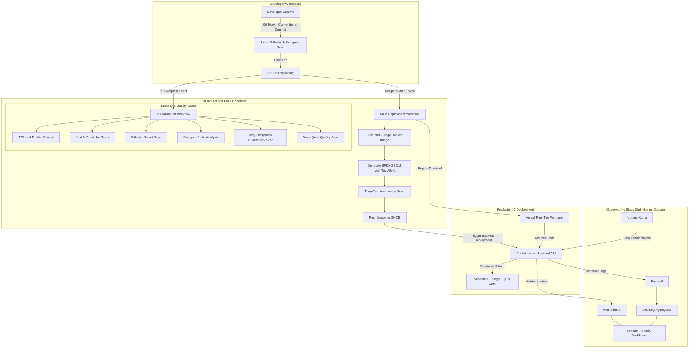

# Enterprise-Grade DevSecOps Pipeline & Reference Architecture

[](https://github.com/your-org/devsecops-enterprise-pipeline/actions/workflows/pr-validation.yml)
[](https://github.com/your-org/devsecops-enterprise-pipeline/actions/workflows/main-deploy.yml)
[](https://github.com/your-org/devsecops-enterprise-pipeline/actions/workflows/security-audit.yml)

A production-ready, zero-cost, enterprise-grade **DevSecOps Pipeline and Cloud Security Architecture** built exclusively using **FREE TIERS** and **SELF-HOSTED OPEN-SOURCE TOOLING**.

---

## Architecture Diagram



---

## Technology Stack & Tool Selection Rationale

| Tool Category | Selected Technology | Pricing Model | Rationale & Tradeoffs |
| :--- | :--- | :--- | :--- |
| **Version Control** | GitHub | Free | Industry standard with integrated Actions, GHCR, and Security advisory tooling. |
| **Frontend Hosting** | Vercel | Free Hobby Tier | Instant preview environments, automatic global edge CDN, zero-config deployment. |
| **Database & Auth** | Supabase | Free Tier | Managed PostgreSQL with built-in Row Level Security (RLS) and OAuth Auth. |
| **Containerization** | Docker & Compose | Free Open Source | Enables self-hosted production parity across developer and local monitoring stacks. |
| **CI/CD Automation** | GitHub Actions | Free 2,000 min/mo | Seamless repo integration with market-leading security scan action community support. |
| **Code Quality / SAST** | SonarQube | Free Community Ed. | Self-hostable via Docker, robust Quality Gate enforcement and OWASP rule detection. |
| **Container Vulnerabilities** | Trivy | Free Open Source | Extremely fast vulnerability database covering OS packages, dependencies, and SBOMs. |
| **SAST (Static Analysis)** | Semgrep | Free Open Source | Lightweight syntax-aware rule engine with zero false-positive tuning capability. |
| **Secret Scanning** | Gitleaks | Free Open Source | High-entropy regex scanner preventing key leaks prior to PR merge. |
| **Dependency Scanning** | Dependabot / npm audit | Free Native | Automated pull requests for CVE remediation across Node.js and Docker dependencies. |
| **Container Registry** | GHCR | Free Tier | Built-in GitHub container registry with native OIDC token integration. |
| **Observability** | Prometheus, Loki, Grafana | Free Open Source | The gold standard open-source telemetry stack for metrics, logs, and alerting. |
| **Uptime Monitoring** | Uptime Kuma | Free Open Source | Self-hosted status page and endpoint health prober replacing paid status services. |

---

## Complete Project Folder Structure

```
.
├── .github/
│   ├── ISSUE_TEMPLATE/
│   │   ├── bug_report.yml
│   │   ├── feature_request.yml
│   │   └── security_vulnerability.yml
│   ├── workflows/
│   │   ├── main-deploy.yml          # Merge to Main Deployment Pipeline
│   │   ├── pr-validation.yml        # PR Validation Pipeline
│   │   ├── release.yml              # Semantic Release & GHCR Publish
│   │   └── security-audit.yml       # Scheduled Weekly Vulnerability Audit
│   ├── CODEOWNERS                   # Security & module owner assignments
│   ├── dependabot.yml               # Multi-ecosystem automated dependency updater
│   └── PULL_REQUEST_TEMPLATE.md     # DevSecOps PR compliance checklist
├── docker/
│   ├── backend.Dockerfile           # Multi-stage security hardened Node.js container
│   └── frontend.Dockerfile          # Nginx unprivileged static frontend container
├── monitoring/
│   ├── grafana/
│   │   ├── dashboards/
│   │   │   └── devsecops-overview.json
│   │   └── provisioning/
│   │       ├── dashboards/dashboards.yml
│   │       └── datasources/datasources.yml
│   ├── loki/
│   │   └── loki-config.yml
│   ├── prometheus/
│   │   └── prometheus.yml
│   └── promtail/
│       └── promtail-config.yml
├── scripts/
│   ├── generate-sbom.sh            # SPDX SBOM generation via Trivy/Syft
│   ├── health-check.sh             # Automated endpoint availability checker
│   └── run-security-scans.sh       # Local security scanning suite runner
├── src/
│   ├── backend/                    # Express API with Helmet, Rate Limits, Metrics
│   │   ├── __tests__/
│   │   │   └── server.test.js
│   │   ├── package.json
│   │   └── server.js
│   └── frontend/                   # React/Vite App with Supabase integration
│       ├── src/
│       │   ├── __tests__/
│       │   │   └── App.test.jsx
│       │   └── App.jsx
│       ├── index.html
│       ├── package.json
│       └── vite.config.js
├── .editorconfig                   # Code formatting standard
├── .env.example                    # Environment variable specification template
├── .eslintrc.js                    # ESLint security & quality rules
├── .gitleaks.toml                  # Gitleaks secret detection rules
├── .gitignore                      # Git ignore specifications
├── .prettierrc                     # Prettier styling configuration
├── .semgrep.yml                    # Semgrep custom SAST security rules
├── .trivyignore                    # Trivy vulnerability exclusion list
├── CHANGELOG.md                    # Release history tracking
├── CODE_OF_CONDUCT.md              # Contributor code of conduct
├── CONTRIBUTING.md                 # DevSecOps contribution standards
├── docker-compose.override.yml     # Local development docker compose overrides
├── docker-compose.yml              # Local production & monitoring stack
├── package.json                    # Workspace root scripts & tooling
├── README.md                       # Master architecture documentation
├── SECURITY.md                     # Vulnerability disclosure & patch SLA policy
├── sonar-project.properties        # SonarQube Community Edition configuration
├── SUPPORT.md                      # Community support guidelines
└── vercel.json                     # Vercel security header policies
```

---

## Prerequisites & Accounts Required

### Required Free Accounts
1. **[GitHub Account](https://github.com/signup)**: Required for repository hosting, GitHub Actions runner execution, GHCR container storage, and Dependabot automation.
2. **[Vercel Account](https://vercel.com/signup)**: Required for zero-cost hosting of the static React/Next.js frontend with global CDN edge deployment.
3. **[Supabase Account](https://supabase.com)**: Required for free-tier PostgreSQL database hosting, authentication provider APIs, and Row Level Security (RLS).
4. **Docker Desktop / Engine**: Self-hosted local runtime for containerization, SonarQube Community Edition, Prometheus, Loki, and Grafana.

---

## Step-by-Step Local Setup Guide

### 1. System Requirements & Installations
Install the required software on your host machine:
- **Git**: `git --version`
- **Docker & Compose**: `docker compose version`
- **Node.js (v20+)**: `node -v`

### 2. Clone Repository & Setup Workspace
```bash
git clone https://github.com/your-org/devsecops-enterprise-pipeline.git
cd devsecops-enterprise-pipeline

# Copy environment variable template
cp .env.example .env
```

### 3. Install Dependencies
```bash
# Install root workspace tooling
npm install

# Install application dependencies
npm install --prefix src/backend
npm install --prefix src/frontend
```

### 4. Launch Local Application & Observability Stack
```bash
# Start Backend, SonarQube, PostgreSQL, Prometheus, Loki, Grafana, Uptime Kuma
docker compose up -d
```

### 5. Access Local Services
- **Backend API**: `http://localhost:5000/health`
- **Frontend App**: `http://localhost:3000` (or `http://localhost:8080`)
- **SonarQube Server**: `http://localhost:9000` (Default: `admin` / `admin`)
- **Grafana Security Dashboards**: `http://localhost:3001` (Default: `admin` / `admin_devsecops`)
- **Prometheus Metrics**: `http://localhost:9090`
- **Uptime Kuma Status**: `http://localhost:3002`

---

## GitHub Setup & Pipeline Configuration

### 1. Repository Creation
Create a new GitHub repository named `devsecops-enterprise-pipeline`. Push your code:
```bash
git remote add origin https://github.com/YOUR_USERNAME/devsecops-enterprise-pipeline.git
git branch -M main
git push -u origin main
```

### 2. Configure GitHub Repository Secrets
Navigate to **Settings -> Secrets and variables -> Actions** and add the following:

| Secret Name | Description | Source / Location |
| :--- | :--- | :--- |
| `SONAR_HOST_URL` | URL of SonarQube instance | e.g. `http://sonarqube.yourdomain.com:9000` |
| `SONAR_TOKEN` | Security analysis token | Generated in SonarQube user account settings |
| `VERCEL_TOKEN` | Vercel CLI deployment token | Generated in Vercel Account Settings -> Tokens |
| `VERCEL_ORG_ID` | Vercel Organization ID | Found in `.vercel/project.json` or Project Settings |
| `VERCEL_PROJECT_ID` | Vercel Project ID | Found in Vercel Project Settings |

### 3. Enable Branch Protection Rules
Navigate to **Settings -> Branches -> Add branch protection rule**:
- **Branch name pattern**: `main`
- ✅ **Require a pull request before merging** (Require 1 approval)
- ✅ **Require status checks to pass before merging**:
  - `Code Linting & Formatting Check`
  - `Unit Testing & Build Verification`
  - `Gitleaks Secret & Credential Scanning`
  - `Semgrep SAST Security Analysis`
  - `Trivy Filesystem Vulnerability Scan`
  - `SonarQube Code Quality & Security Gate`
- ✅ **Require signed commits** (Optional but recommended)
- ✅ **Include administrators**

---

## SonarQube Setup Guide

1. Start SonarQube locally via Docker Compose: `docker compose up -d sonarqube`.
2. Login to `http://localhost:9000` using `admin` / `admin`. Change password when prompted.
3. Go to **My Account -> Security** and click **Generate Token**.
4. Save the token as a GitHub Secret (`SONAR_TOKEN`).
5. Copy project key from `sonar-project.properties`: `devsecops-enterprise-pipeline`.

---

## Supabase Setup Guide

1. Create a free project at [Supabase](https://supabase.com).
2. Under **Project Settings -> API**, copy:
   - `Project URL` -> Set as `SUPABASE_URL`
   - `anon public` key -> Set as `SUPABASE_ANON_KEY`
   - `service_role` key -> Set as `SUPABASE_SERVICE_ROLE_KEY`
3. Under **Authentication -> Policies**, enable **Row Level Security (RLS)** on all custom database tables.

---

## Vercel Setup Guide

1. Import your GitHub repository into Vercel Dashboard.
2. Select **Framework Preset**: Vite / React.
3. Set **Root Directory**: `src/frontend`.
4. Configure environment variables in Vercel Settings (`SUPABASE_URL`, `SUPABASE_ANON_KEY`).
5. Generate a Vercel Access Token under **Account Settings -> Tokens** and set `VERCEL_TOKEN`, `VERCEL_ORG_ID`, `VERCEL_PROJECT_ID` in GitHub Secrets.

---

## Security Scanning & Enforcement Documentation

### 1. Gitleaks (Secret Detection)
- **Mechanism**: Scans code commits, git history, and pull requests for high-entropy strings, private keys, and API key patterns defined in `.gitleaks.toml`.
- **Enforcement**: Blocks PR merges if any secret is discovered.

### 2. Semgrep (SAST)
- **Mechanism**: Semantic syntax tree analysis matching security vulnerabilities against custom patterns in `.semgrep.yml` and OWASP Top 10 rules.
- **Enforcement**: Fails PR validation on any `ERROR` level finding (e.g., `eval()` calls, unhandled security headers).

### 3. Trivy (SCA & Container Image Scan)
- **Mechanism**: Scans target filesystems and built container layers against the CVE vulnerability database. Generates SPDX-compliant SBOMs.
- **Enforcement**: Fails pipeline on `HIGH` or `CRITICAL` unpatched vulnerabilities.

### 4. SonarQube (Quality Gate & Code Smells)
- **Mechanism**: Calculates code coverage, duplicated code blocks, security hotspots, and cognitive complexity.
- **Enforcement**: Quality Gate status MUST return `PASSED` before merging into `main`.

---

## Deployment & Disaster Recovery Playbook

### Staging & Production Deployment
- **Frontend**: Automated push to Vercel global edge CDN on `main` merge.
- **Backend**: Container built, scanned, tagged, and pushed to `ghcr.io/your-org/devsecops-backend:latest`.

### Rollback Strategy
1. **Frontend Rollback**: Navigate to Vercel Dashboard -> Deployments -> Select previous stable deployment -> Click **Promote to Production**.
2. **Backend Rollback**: Redeploy previous container tag from GHCR:
```bash
docker pull ghcr.io/your-org/devsecops-backend:v1.0.0
docker tag ghcr.io/your-org/devsecops-backend:v1.0.0 ghcr.io/your-org/devsecops-backend:latest
```

---

## Comprehensive 30+ Scenario Troubleshooting Matrix

| # | Issue Symptom | Underlying Root Cause | Exact Remediation Step |
| :- | :--- | :--- | :--- |
| 1 | `Docker won't start / daemon unreachable` | Virtualization disabled or Docker service stopped | Run `net start com.docker.service` (Windows) or `sudo systemctl start docker` (Linux). |
| 2 | `SonarQube container fails to start` | `vm.max_map_count` too low for Elasticsearch | Linux: `sudo sysctl -w vm.max_map_count=262144`. Add to `/etc/sysctl.conf`. |
| 3 | `SonarQube quality gate failed in CI` | Uncovered code or security hotspot | Review SonarQube UI (`http://localhost:9000`), write missing unit tests or mark hotspots as reviewed. |
| 4 | `Gitleaks fails on false positive secret` | Test file contains dummy key string | Add pattern or file path to `[allowlist]` section in `.gitleaks.toml`. |
| 5 | `Semgrep fails on CORS configuration` | Express app uses `cors({ origin: '*' })` | Update `CORS_ORIGIN` in `.env` to explicit domains (e.g. `http://localhost:3000`). |
| 6 | `Trivy scan fails on high CVE` | Outdated base image package | Update base image version in `docker/backend.Dockerfile` (e.g. `node:20-alpine`). |
| 7 | `GitHub Actions permission denied on GHCR` | Missing `packages: write` scope | Add `permissions: { packages: write }` block to `.github/workflows/main-deploy.yml`. |
| 8 | `Vercel deployment fails on root dir` | Incorrect build path setting | Set `outputDirectory: "src/frontend/dist"` in `vercel.json`. |
| 9 | `Supabase authentication error` | Invalid Anon API key or domain CORS policy | Verify `SUPABASE_ANON_KEY` in `.env` and add domain in Supabase Auth -> URL Configuration. |
| 10 | `Backend rate-limiting blocking local tests` | `RATE_LIMIT_MAX_REQUESTS` exceeded | Increase `RATE_LIMIT_MAX_REQUESTS=1000` in `.env.test.local`. |
| 11 | `Port conflict on port 5000` | Local process already bound to port | Run `netstat -ano \| findstr :5000` (Windows) or `lsof -i :5000` (Linux) and terminate process. |
| 12 | `Port conflict on port 9000 (SonarQube)` | Local service running on port 9000 | Change host mapping in `docker-compose.yml` to `"9001:9000"`. |
| 13 | `Prometheus scraper returning 404 on /metrics` | Express app missing `prom-client` route | Verify `app.get('/metrics')` endpoint is registered in `server.js`. |
| 14 | `Grafana dashboard empty` | Prometheus datasource configuration mismatched | Check `monitoring/grafana/provisioning/datasources/datasources.yml` for correct URL `http://prometheus:9090`. |
| 15 | `Loki log ingestion failure` | Promtail unable to read `/var/log` permissions | Ensure Promtail runs with volume permissions to read container runtime logs. |
| 16 | `Dependabot PR build failing` | Breaking API changes in dependency | Review lockfile, update breaking code usage, or pin dependency version in `package.json`. |
| 17 | `Helmet CSP breaking inline scripts` | Strict `Content-Security-Policy` header | Add nonces or host domains to Helmet scriptSrc directive in `server.js`. |
| 18 | `Supabase RLS policy blocking database queries` | Missing SELECT/INSERT policy for authenticated user | Execute `CREATE POLICY "Enable read for users" ON table FOR SELECT USING (true);` in Supabase SQL editor. |
| 19 | `Health check script timing out` | Backend service taking >30s to initialize | Increase `MAX_RETRIES` or start-period in `docker/backend.Dockerfile`. |
| 20 | `Prettier formatting check failing in CI` | Unformatted files committed | Run `npm run format:fix` locally and commit changes before pushing. |
| 21 | `ESLint rule security/detect-object-injection error` | Dynamic key indexing without validation | Validate key input against allowlist map before array indexing. |
| 22 | `Jest test suite hanging on open handles` | Server listener not closed post test run | Export `app` without calling `.listen()` in module root or pass `--detectOpenHandles`. |
| 23 | `Vitest DOM elements undefined` | `jsdom` environment missing in Vite config | Ensure `test: { environment: 'jsdom' }` is configured in `src/frontend/vite.config.js`. |
| 24 | `Git push rejected due to signed commits policy` | GPG key not associated with GitHub account | Configure GPG signing key: `git config --global user.signingkey <KEY_ID>`. |
| 25 | `GHCR container pull unauthorized` | Missing authentication token in target host | Execute `echo $GH_TOKEN \| docker login ghcr.io -u USERNAME --password-stdin`. |
| 26 | `Uptime Kuma prober status DOWN` | `/health` endpoint returning 500 error | Check backend server logs via `docker compose logs backend`. |
| 27 | `SBOM generation script failing` | Trivy CLI missing SPDX format support | Upgrade Trivy to latest version `aquasec/trivy:latest`. |
| 28 | `Vercel preview environment CORS failure` | Preview URL not listed in backend CORS origins | Update Express CORS middleware regex pattern to match `*.vercel.app`. |
| 29 | `SonarQube JDBC connection timeout` | Postgres DB container starting slower than SonarQube | Add `depends_on: { sonarqube-db: { condition: service_healthy } }` in compose. |
| 30 | `Node.js memory leak warning` | Prometheus default metrics listener accumulation | Re-use single instance of `prom-client.Registry()` in application lifecycle. |
| 31 | `CORS Preflight (OPTIONS) request failing` | Express router missing OPTIONS handler | Ensure `cors()` middleware is mounted prior to defining application routes. |
| 32 | `Git hook bypassing security scans` | `--no-verify` flag used on git commit | Enforce branch protection checks on GitHub server-side so bypass is impossible. |
